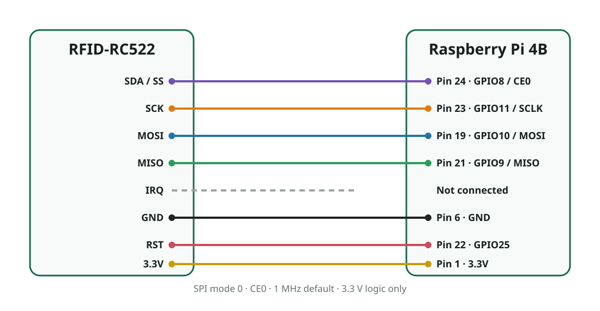

# MFRC522 RFID reader

The Raspberry Pi 4B image supports an MFRC522/RC522 reader on SPI0 chip-select
0. The image enables SPI, installs a board overlay, binds the device to
`spidev`, and includes `mfrc522-tool` for chip detection, ISO/IEC 14443A UID
selection, and authenticated MIFARE Classic block reads and writes.



## Wiring

| MFRC522 | Raspberry Pi physical pin | BCM function |
| --- | --- | --- |
| SDA / SS | 24 | GPIO8 / SPI0 CE0 |
| SCK | 23 | GPIO11 / SPI0 SCLK |
| MOSI | 19 | GPIO10 / SPI0 MOSI |
| MISO | 21 | GPIO9 / SPI0 MISO |
| IRQ | Not connected | Not used; the driver polls |
| GND | 6 | Ground |
| RST | 22 | GPIO25 |
| 3.3V | 1 | 3.3 V power |

The MFRC522 is a 3.3 V device. Do not connect it to a 5 V power pin or apply
5 V logic to its SPI or reset pins. Power down the Pi before changing wiring.

## Image integration

The `mfrc522-overlay` recipe builds `overlays/mfrc522.dtbo`. New WIC images put
it on the shared FAT partition and add `dtoverlay=mfrc522` to `config.txt`. The
overlay describes `nxp,mfrc522` on SPI0 CE0 at 1 MHz and GPIO25 as active-low
reset. A small kernel patch permits the product userspace protocol driver to
access this compatible through `/dev/spidev0.0`.

The current RAUC bundle updates root filesystems but not the shared FAT boot
partition. An existing device originally flashed without this overlay can
still use `mfrc522-tool` because `ENABLE_SPI_BUS` already exposes SPI0 CE0; the
tool directly controls GPIO25. Reflash a new WIC image if the deployed device
tree itself must contain the MFRC522 description.

Build the image and signed OTA bundle with:

```sh
./scripts/build-rpi4b.sh rpi4-update-bundle
```

## Verify the reader

After booting the new image, verify the device node and read the MFRC522
VersionReg register:

```sh
ls -l /dev/spidev0.0 /dev/gpiochip0
mfrc522-tool version
```

Typical genuine silicon reports `version=0x91` or `version=0x92`. A value of
`0x00` or `0xff` indicates a wiring, reset, chip-select, or power problem.

Place one ISO/IEC 14443A card over the antenna and scan its UID:

```sh
mfrc522-tool scan
```

Example output:

```text
uid=deadbeef atqa=0400 sak=08
```

`Connection timed out` is the expected result when no compatible card is in
the RF field. If the message alternates with successful UID output while a
card is being moved, SPI is working; centre the card flat over the antenna and
keep it within a few centimetres. A stable `version=0x91`, `version=0x92`, or
the `0x88` reported by some clones confirms communication with the reader's
digital core.

## Read and write MIFARE Classic blocks

Reading and writing requires the correct six-byte sector key. Many development
cards ship with Key A set to `ffffffffffff`. To read block 4:

```sh
mfrc522-tool read 4 A ffffffffffff
```

To write exactly 16 bytes to block 4:

```sh
mfrc522-tool write 4 A ffffffffffff 00112233445566778899aabbccddeeff
```

The utility deliberately refuses writes to manufacturer block 0 and MIFARE
Classic sector-trailer blocks. Changing access bits or keys incorrectly can
make a sector permanently inaccessible. Test writes only on disposable cards
you own and are authorized to modify.

For a MIFARE Classic 1K card, the 64 16-byte blocks are arranged as 16
sectors. Each sector has three data blocks followed by a sector trailer. For
example, sector 1 contains data blocks 4 through 6 and trailer block 7;
sector 2 contains data blocks 8 through 10 and trailer block 11. Sector 0 is
special because block 0 holds manufacturer data and the UID.

Each sector has independent Key A and Key B values. A successful read of block
1 with a key proves that key only for sector 0; it says nothing about block 4
in sector 1. If UID selection succeeds but the command reports
`authentication failed`, first keep the card stationary and retry. Persistent
failure for one sector while another sector reads successfully means the
sectors use different keys. Obtain those keys from the card's authorized
provisioning system; they cannot be inferred from the UID, and Key A is never
disclosed by a normal block read.

The read/write commands implement MIFARE Classic authentication and are not a
general NDEF writer. UID scanning works with ISO/IEC 14443A cards supported by
the MFRC522, but memory operations vary by card family.

## Validated bring-up sequence

The complete path has been exercised on a Raspberry Pi 4B with an MFRC522
reporting version `0x92`:

```text
# mfrc522-tool version
version=0x92
# mfrc522-tool scan
uid=<redacted> atqa=0400 sak=08
# mfrc522-tool read 4 A ffffffffffff
uid=<redacted> atqa=0400 sak=08
block=4 data=00000000000000000000000000000000
```

This sequence verifies SPI register access, GPIO reset, RF card discovery,
ISO/IEC 14443A selection, MIFARE Classic authentication, and a 16-byte block
read. A UID should not by itself be treated as a secure access credential,
because compatible card UIDs may be copied or emulated.

## Troubleshooting

Run the tool as root initially. If `version` cannot open the devices, confirm
that SPI is enabled and inspect the boot configuration and kernel messages:

```sh
grep -E '^(dtparam=spi|dtoverlay=mfrc522)' /boot/config.txt
dmesg | grep -Ei 'spi|mfrc522'
```

Keep the SPI leads short. If communication is unreliable, confirm the 3.3 V
supply and common ground before reducing `--speed` below its 1 MHz default.
